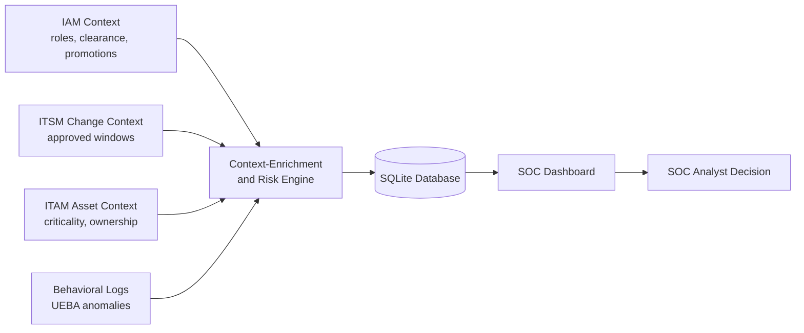
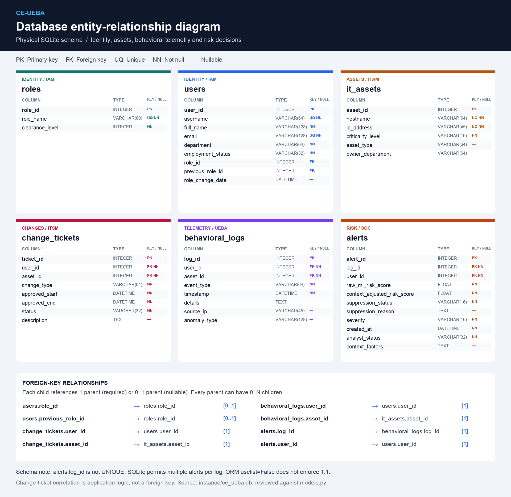

# 🛡️ CE-UEBA

### Context-Enriched User and Entity Behavior Analytics

**Every signal has a story. Understand the context behind the anomaly.**

`Python 3.11+` · `Flask` · `SQLite` · `Chart.js` · `uv`

[Quick start](#installation) · [Context sources](#context-sources) · [Architecture](#architecture) · [Risk engine](#risk-engine) · [Demo walkthrough](#walkthrough)


An academic proof-of-concept web application for a Cyber Information Systems
capstone project, developed for the fictional digital banking institution
**FinansTech Ltd.** All names, e-mail addresses, hostnames, IP addresses and
organizational information are synthetic. IPs use documentation-safe ranges
(RFC 5737): `192.0.2.0/24`, `198.51.100.0/24`, `203.0.113.0/24`.
  
> **Important:** the risk engine is an explainable academic **simulation**
> and is **not** a validated production detection model.

## 🔎 Project overview

CE-UEBA is a local web application for exploring how business context can
change the interpretation of unusual user activity. It provides a SOC
(Security Operations Center) dashboard, alert explanations, employee profiles,
and a workflow for recording analyst decisions.

A deployment outside normal working hours might look suspicious. An approved
maintenance ticket can help explain it. Activity from a suspended account,
however, adds a reason for concern. This project demonstrates both outcomes
using deterministic rules and synthetic scenarios.

### What you can explore

- **Risk comparison:** compare each initial score with its context-adjusted score.
- **Automatic filters:** changing severity, suppression, department, or event type
  reloads the dashboard with matching alerts, metrics, and charts.
- **Explainable decisions:** expand a decision reason or open an alert to inspect
  the identity, asset, change tickets, and stored contextual factors.
- **Employee context:** review roles, activity, assets, and change history.
- **Analyst triage:** record Open, Investigating, Closed as Benign, or Confirmed Threat.

<a id="context-sources"></a>

## 🧩 Context sources: IAM, ITSM, ITAM, and behavior

**A source is the system or record that supplies a piece of context.** In a
real organization, these records would come from several business and security
systems. In this project, all of them come from [seed_data.py](seed_data.py)
and are stored in a local SQLite database. No external enterprise systems are
connected, and no real employee data is collected.

| Source | Full name | Question it helps answer | Typical organizational records | Representation in this project |
|---|---|---|---|---|
| 👤 **IAM** | Identity and Access Management | Who is acting, and what role do they hold? | Identity directories, access assignments, role histories | `users` and `roles`: identity, department, clearance, current and previous roles |
| 🎫 **ITSM** | IT Service Management | Is there approved work that explains this activity? | Change requests, approvals, scheduled maintenance windows | `change_tickets`: user, asset, status, start/end times, change description |
| 🖥️ **ITAM** | IT Asset Management | What system is involved, and how important is it? | Asset inventories, ownership records, criticality classifications | `it_assets`: hostname, IP, type, owning department, criticality |
| 📡 **Behavioral / UEBA** | User and Entity Behavior Analytics | What activity was unusual? | Authentication, application, database, network, and endpoint events | `behavioral_logs` plus simulated initial scores stored in `alerts` |
| 🏢 **HR context** | Human Resources context | Is the person active, suspended, or terminated? | Employment status, department changes, promotion records | Synthetic employment status and role-change dates in `users` |

### 👤 IAM: identity and access context

IAM describes accounts, roles, and access responsibilities. HR information can
help keep that identity context aligned with employment changes.

The demo checks whether a role changed within 30 days of evaluation and whether
the new clearance is at least the previous clearance. It also raises risk for
activity associated with a suspended or terminated employee. These checks are
illustrative; a role change does not prove that every subsequent action is authorized.

### 🎫 ITSM: approved operational changes

ITSM includes the processes used to manage IT services and changes. CE-UEBA
uses the change-management part: tickets describing approved work.

A ticket contributes legitimate context only when the **user and asset match**,
its status is **Approved** or **In Progress**, and the event occurred **inside
the approved time window**. The demo does not additionally match the event type
to the ticket's change type. A ticket outside the window provides no reduction.

### 🖥️ ITAM: asset ownership and importance

ITAM records which assets exist, who owns them, and their business importance.
A configuration management database (**CMDB**) can provide related configuration
and service information in an enterprise deployment; this demo uses its own
small asset inventory.

Access to an asset owned by the user's department lowers risk slightly.
Access to a critical asset raises it. Department alignment is weak evidence:
**it cannot suppress an alert on its own.**

### 📡 Behavioral events and ML scores

**ML means Machine Learning.** A real UEBA system may use a trained model to
identify unusual behavior and produce a risk signal. Here, the initial scores
are predefined demo values; no model is trained or run.

- **Raw risk:** the initial simulated score before enrichment.
- **Context-adjusted risk:** the score after the explicit rules are applied.
- **Severity:** a label derived from the adjusted score.
- **Suppression:** a rule-based decision that an alert is likely benign.
- **Analyst status:** a separately recorded human review decision.

Suppression is not proof of safety, and a high score is not proof of an attack.
Neither score is a calibrated probability: **82/100 does not mean an 82% chance
of malicious activity.**

### Related terms

| Term | Meaning | Relevance here |
|---|---|---|
| **SOC** | Security Operations Center | The team or function reviewing alerts |
| **SIEM** | Security Information and Event Management | A possible future source of aggregated security events; not integrated |
| **EDR** | Endpoint Detection and Response | A possible future source of device activity; not integrated |
| **SSO** | Single Sign-On | A potential future login mechanism; not implemented |
| **RBAC** | Role-Based Access Control | A potential future way to restrict console actions; not implemented |
| **CSRF** | Cross-Site Request Forgery | The review form uses a CSRF token to protect POST requests |
| **POC** | Proof of Concept | A demonstration of an idea, rather than a production security system |


## 🏗️ Architecture

Flask monolith with a clean layer separation:

- `risk_engine.py` — deterministic, explainable, framework-independent risk
  adjustment module (rules documented below).
- `models.py` — Flask-SQLAlchemy models on SQLite with enforced foreign keys.
- `app.py` — application factory, routes, filters, security headers, error handling.
- `seed_data.py` — idempotent synthetic data generator for demo scenarios A–E.
- Templates + Chart.js — dark SOC dashboard, drill-down pages, filters.

### Logical data flow (Mermaid)



### Processing sequence

1. The seed script constructs a synthetic behavioral anomaly.
2. The raw ML score is recorded.
3. Identity context (IAM) is retrieved.
4. Asset context (ITAM) is retrieved.
5. Approved change tickets (ITSM) are evaluated.
6. The risk engine calculates an adjusted score.
7. The system decides whether the alert may be suppressed.
8. The SOC analyst reviews active alerts.

## 🗃️ Database entities

### Entity-relationship diagram (ERD)

**Database design submission:** [Short explanation (PDF)](docs/database-design/Database_Design_Explanation.pdf) · [ERD image](docs/database-design/CE_UEBA_ERD.png) · [Editable explanation](docs/database-design/Database_Design_Explanation.md)



[Open full-resolution PNG](static/assets/erd_schema.png) · [Open scalable SVG](static/assets/erd_schema.svg)

Generated from the default SQLite database (`instance/ce_ueba.db`) and checked
against `models.py`. The diagram includes every column, its declared type,
primary and foreign keys, unique constraints, and nullability. The relationship
panel lists all eight foreign keys and their parent cardinalities.

**Log-to-alert cardinality:** SQLite permits multiple alerts per log because
`alerts.log_id` is not unique. The ORM's `uselist=False` does not enforce a
one-to-one database constraint. Change-ticket correlation is application logic,
not a foreign key.

| Entity | Purpose |
|---|---|
| `roles` | Role name and clearance level (1–5). |
| `users` | Employee identity, department, employment status, current and previous role, role change date. |
| `it_assets` | Hostname, IP, criticality, asset type, owner department. |
| `change_tickets` | ITSM tickets: user, asset, change type, approved window, status, description. |
| `behavioral_logs` | Raw events: user, asset, event type, timestamp, details, source IP, anomaly type. |
| `alerts` | Per-anomaly record: raw and adjusted risk scores, severity, suppression status and reason, analyst status, JSON contextual factors. |


## ⚖️ Risk-scoring logic

Scores are on a 0–100 scale. All adjustments are additive on the raw score
and clamped to [0, 100]:

| Rule | Condition | Impact |
|---|---|---|
| Approved change window | Same user + asset, ticket status Approved/In Progress, event inside approved window | **−35** |
| Recent authorized role change | Role changed within 30 days and new clearance ≥ old clearance | **−20** |
| Departmental asset alignment | Asset owned by the user's department | **−10** (never suppresses alone) |
| Inactive employee | Employment status Terminated/Suspended with activity | **+30** |
| Critical asset | Asset criticality is Critical | **+15** |
| Highly privileged action | `privilege_escalation`, `bulk_export`, `unauthorized_configuration_change`, `disabled_security_control` | **+20** |

**Severity:** 0 ≤ score < 30: Low · 30 ≤ score < 60: Medium ·
60 ≤ score < 80: High · 80 ≤ score ≤ 100: Critical.

**Suppression** is allowed only when all of the following hold:

- adjusted score < 40,
- at least one *strong* legitimate factor exists (change window or role change —
  departmental alignment alone is never sufficient),
- no critical suspicious factor exists, and
- the user is not terminated or suspended.

Each alert stores a decision reason and the contextual factor list as JSON.

**Worked example — approved deployment:**

```text
Initial simulated risk          82
Approved change window         −35
Department alignment           −10
                              ───
Context-adjusted risk           37 → Medium severity, Suppressed
```

A Medium alert can be suppressed because the suppression threshold is 40,
while Medium severity starts at 30. Severity and suppression describe different
aspects of the decision.


## 🚀 Installation

Prerequisites: Python 3.11+ and `uv`. No Node.js, npm, Docker or external
database required. An **internet connection is required at runtime** for the
CDN-hosted Bootstrap 5, Bootstrap Icons and Chart.js libraries (offline
alternative described at the end of this section). Bootstrap 5.3.3 CSS/JS are
loaded with SRI `integrity` attributes.

### Run with NO uv (macOS, Linux, or Windows)
**Windows PowerShell:**
```powershell
cd ce_ueba_flask_app
python3 -m venv .venv
source .venv/bin/activate
python -m pip install -r requirements.txt
python seed_data.py
FLASK_DEBUG=1 python app.py
```

Open http://127.0.0.1:5001.

### Run with uv (macOS, Linux, or Windows)

Install uv first if it is not available.

**macOS / Linux:**

```bash
curl -LsSf https://astral.sh/uv/install.sh | sh
```

```powershell
powershell -ExecutionPolicy ByPass -c "irm https://astral.sh/uv/install.ps1 | iex"
```

Restart your terminal after installing uv. Extract the project archive, then
run the following from its parent folder. If already inside the folder
containing `app.py` and `pyproject.toml`, skip the `cd` command:


```bash
cd ce_ueba_flask_app
uv python install 3.12
uv sync --python 3.12 --locked
uv run python seed_data.py
FLASK_DEBUG=1 uv run python app.py
```

`uv sync` installs the application and test dependencies into `.venv`.
There is no need to activate the virtual environment. Dependencies are defined
in `pyproject.toml`; `uv.lock` records the resolved versions for reproducible installs. The first sync requires access to the Python package registry.

Then open <http://127.0.0.1:5001/> in your browser; Flask does not open it automatically.
Port 5001 avoids the macOS AirPlay Receiver service on port 5000.
Keep the terminal open; press **Ctrl+C**
to stop the server. On subsequent runs, use only `uv run python app.py` from
the application folder. Python 3.12 is the suggested setup above; uv can
install it even if Python is not already installed.

### Editing locally

To automatically restart after Python edits:

**macOS / Linux:**

```bash
FLASK_DEBUG=1 uv run python app.py
```

**Windows PowerShell:**

```powershell
$env:FLASK_DEBUG = "1"
uv run python app.py
```

Use debug mode for local development only. Refresh the browser after HTML or
CSS edits. If styles are cached, use **Cmd+Shift+R** on macOS or **Ctrl+Shift+R**
on Windows/Linux.

### Troubleshooting

| Symptom | What to do |
|---|---|
| `uv` is not found | Restart your terminal after installation and check that uv is on PATH. |
| `app.py` cannot be found | Open the terminal in `ce_ueba_flask_app`. |
| No demo alerts appear | Run `uv run python seed_data.py`. |
| Port 5001 is busy | Run `uv run flask --app app:application run --port 5002`, then open `http://127.0.0.1:5002`. |
| Charts or icons are missing | Check internet access to the CDN; the table still provides alert scores. |
| The database opens as unreadable text | It is a binary SQLite file; inspect it with a SQLite viewer rather than a text editor. |


### Configuration (optional environment variables)

| Variable | Purpose | Default |
|---|---|---|
| `CE_UEBA_SECRET_KEY` | Flask secret key (set in production) | documented dev-only fallback |
| `CE_UEBA_DATABASE_URI` | SQLAlchemy URI | `sqlite:///<instance>/ce_ueba.db` |
| `FLASK_DEBUG` | `1` enables debug mode (off by default) | off |

### Database initialization & seed data

`app.py` creates the schema automatically on startup. `seed_data.py` is
**idempotent** — running it repeatedly never duplicates records. Existing seed data is left unchanged, including its timestamps.
To reset the demo, stop the server, back up any data you want to retain,
delete `instance/ce_ueba.db`, and re-run the seed script. This also removes
saved analyst decisions.

### Test execution

```bash
uv run pytest
```

Test fixtures use temporary SQLite databases under pytest's `tmp_path`.
Importing `app.py` also constructs its default application and may create the
local database schema; test records and review changes use the temporary databases.

### Offline usage

To run fully offline, download the Bootstrap CSS/JS, Bootstrap Icons and
Chart.js files, place them in `static/css/` / `static/js/`, reference them
from `templates/base.html` (and `dashboard.html`) instead of the CDN URLs,
and update the CDN source entries in `Content-Security-Policy` in `app.py`
for local assets. Preserve any directives needed for existing inline styles.
Download Bootstrap Icons' font files too, maintaining their relative paths.

## 🧪 Demo scenarios

| # | Scenario | Employee | Expected outcome |
|---|---|---|---|
| A | Approved software deployment during a change window | Aylin Kaya (DevOps) | Raw 82 → suppressed (~37) |
| B | Recent promotion, first access to the reporting system | Selin Yilmaz | Raw 50 → suppressed (~35) |
| C | Suspended employee bulk export from the core DB | Can Korkmaz | Raw 70 → **100 Critical, active** |
| D | Privilege escalation on the identity server | Mert Simsek | Raw 65 → **100 Critical, active** |
| E | IT admin maintenance covered by an ITSM ticket | Zeynep Arslan | Raw 72 → suppressed (~27) |

Additional supporting scenes demonstrate: tickets outside their window
(Elif Sahin), department alignment alone never suppressing (Kerem Tan,
Nihan Dogan), and security-control tampering (Zeynep Arslan).

## 🧑‍💻 Demo walkthrough

1. Open `/` to explore the context story and worked deployment example.
2. Enter `/dashboard` and compare initial and adjusted scores.
3. Select **Suppressed** to inspect legitimate-context examples.
4. Select **Active** and **Critical** to inspect higher-risk events.
5. Open **Review** on an alert and read its stored factors and supporting records.
6. Record an analyst status, then visit the employee profile for more context.

The table, metrics, and charts reflect the selected filters. Alert timestamps
are displayed in UTC. The simulation does not measure real detection accuracy
or prove that suppression has reduced false positives in a production environment.

## 📦 Sharing the project

Include the Python files, `pyproject.toml`, `uv.lock`, `pytest.ini`, this README,
`templates/`, `static/`, and `tests/`. The `requirements.txt` file is retained
for compatibility; the documented uv workflow uses `pyproject.toml` and `uv.lock`.

Exclude `.venv/`, `__pycache__/`, `.pytest_cache/`, and local `.env` files.
Recipients should create their own environment with `uv sync` and generate
their own demo database with the seed script. Include `instance/ce_ueba.db`
only if you intentionally want to share the current demo state.

## 🔐 Security considerations

- ORM parameterized queries only; no SQL string concatenation.
- Route parameters and form input validated against whitelists
  (severity, suppression status, analyst status).
- CSRF protection on the POST review endpoint (Flask-WTF).
- `SECRET_KEY` read from `CE_UEBA_SECRET_KEY`; the fallback is documented
  as development-only.
- No hardcoded credentials anywhere in the codebase.
- Jinja2 autoescaping is on; the `|safe` filter is not used for any
  user-controlled value.
- Debug mode off by default (`FLASK_DEBUG=1` to enable).
- Secure response headers: `nosniff`, `X-Frame-Options: DENY`,
  `Referrer-Policy`, and a strict `Content-Security-Policy` scoped to
  `self` + the jsDelivr CDN.
- 1 MB `MAX_CONTENT_LENGTH`.
- Safe 404/500 error pages; stack traces never reach the client.
- The SQLite file lives in `instance/`, outside `static/`, so it is never
  exposed by static routes.
- Alert status changes require POST.

## 📌 POC limitations

- The "ML model" and raw risk scores are simulated — deterministic seed values,
  not a trained model.
- SQLite is single-writer and not suitable for production log volumes.
- Authentication/authorization and audit trails (who reviewed what, when) are omitted.
- The risk engine's weights are illustrative; they are not tuned or validated
  against real-world data.
- No streaming ingestion; data is batch-seeded.
- Logs are anonymization-free synthetic data with assumed-consistent timestamps
  seeded relative to "now".

## 🧭 Future development

1. Replace the simulated raw score with a real UEBA model (e.g., isolation
   forest / autoencoder) with proper training and validation.
2. Migrate to PostgreSQL with retention, indexing and partitioning.
3. Add authentication (SSO/OIDC), RBAC for the SOC console and full audit logging.
4. Add authenticated connectors for IAM, HR, ITSM, ITAM, SIEM, and EDR data;
   handle identity matching, stale context, provenance, and ingestion failures.
5. Tune rule weights empirically; add feedback loops from analyst verdicts.
6. Add unit, integration and load testing pipelines plus CI/CD.
7. Comply with data-protection requirements (retention, pseudonymization).
